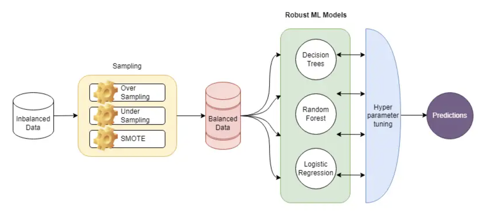

## Credit-Card-Fraud-Detection-System

### Motivation
The escalating volume of digital transactions and increasingly sophisticated fraud techniques necessitate development of highly performant fraud detection models. This project is motivated by the technical challenge of applying advanced machine learning algorithms to build a system that achieves superior accuracy and reliability in distinguishing fraudulent from legitimate credit card transactions.

My motivation is rooted in leveraging data science to tackle critical financial risk. By meticulously analyzing transaction data, engineering relevant features, and implementing robust model validation, we aim to create a system that effectively mitigates financial losses for both consumers and institutions. The project's success will demonstrate the power of data analytics in enhancing financial security and fostering trust in digital payment ecosystems.

### Methodology

 
   
 End-To-End Fraud Prevention System Workflow Schema

1. [Data Overview](#Data-Overview)
  
You can download the data from https://www.kaggle.com/datasets/ealtman2019/credit-card-transactions. 
- Understanding unbalanced data and converting class into factors  
Content:  
The dataset presents an extensive collection of around 24.4 million credit card transactions, sourced from IBM's financial database. Capturing a wide spectrum of user interactions, the data provides a detailed snapshot of transaction behaviors, patterns, and potential vulnerabilities.

2. [Data Preprocessing](#Data-Preprocessing)

- Fixing inconsistencies and missing values to keep the data clean, and remove redundancies for accuracy.

- [Scaling & Distributing](#Scaling-&-Distributing)

3. [Exploratory Data Analysis](#Exploratory-Data-Analysis)

- [Fraud Dataset](#Fraud-Dataset)  
    - [Card Distribution](#Card-Distribution) 

    - [Time Distribution](#Time-Distribution)  
    *Time Variation*: The distribution of fraud cases displays distinct time variations
        - [Year](#Year)
        - [Month](#Month)
        - [Day of Month](#Day-of-Month)
        - [Day of Week](#Day-of-Week)
        - [Hour](#Hour)

    - [Amount Distribution](#Amount-Distribution) 
    
    - [Geographical Distribution](#Geographical-Distribution) 
        - [State](#State) 
        - [City](#City) 

    - [Transaction Method](#Transaction-Method)  
    *Transaction Amount*: Fraud is predominantly observed in transactions of smaller values 

    - [Checking Outliers](#Checking-Outliers) 

4. [ML Model Optimization](#ML-Model-Optimization)

    Implementing Logistic Regression on three sampling methods which are undersampling, oversampling and SMOTE  
    Improve Logistic Results using Decision Tree & Random Forest on SMOTE  
    Implementing ANN (Artificial Neural Network)  
    Evaluation of model results using Performance Metrics (Recall, Precision and F1score, AUC-ROC)  
    Displaying Performance Reports  

5. [Insights](#Insights)

    Exploratory Data Analysis showed that some variables have significant impact on the fraud rate such as time, amount and transaction method, so I incorporated them into the predictive models. 

### Models Comparison
- Please refer to the Jupyter notebook Fraud_Detection_Report.ipynb for model comparison details.